# Mental Arithmetic Quiz

Welcome to Mental Arithmetic Quiz. Mental Arithmetic Quiz is an online quiz that allow user test how quick they are able to solve maths problems mentally, if they are able to beat the time. Users can take part in randomly generated arithmetic quiz of 3 difficulties level, LEVEL 1, LEVEL 2 and LEVEL 3. Each question is presented with four answer options out of one correct answer. Both correct and incorrect answers are highlighted to allow them to learn from the experience. They are able to move up a level as a way of challenging themselves. User gets a feed back result of their score after anwsering the questions. The quiz was designed to be interactive and engaging for user, having user want to play again.

      

 ***                                    

# Table of Contents

1. [Overview]()
2. [Features]()
   + [Existing Features]()  
   + [Future Features]() 
3. [User Experience]()
   + [Site Goals]()  
   + [User Stories]() 
   + [Design Structure]() 
   + [Typography and Color Scheme]() 
   + [Wireframes]() 
4. [Technologies]() 
5. [Testing]() 
   + [Code validation]()
   + [Lighthouse]()
   + [Test case]()
6. [Bugs]()
   + [Manual Testing]()
   + [Fixed bugs]()
   + [Unknown bugs]()
7. [Deployment]() 
8. [Citation of Sources]() 
   + [Content]()
   + [Media]()
9. [Acknowledgements]() 

***
# 1. Overview

The aim of this project is to demonstrate my skills in HTML, CSS and JavaScript for it's interactivity.

This quiz is targeted towards individuals with the aim for learning or just a great way to exercise the brain and in so doing keeping the mind sharp. Children can learn simple arithmetic online, adults including the elderly could use the website to sharpen their mind, prepare for job interviews or it could just be a fun arithmetic games website.

+ Key Information for the website:
  +	Enter a username.
  +	Read the rules of the quiz.
  +	Choose a level to start.
  +	Start the quiz.
  +	Choose the correct answer from the multiple choice within the allotted time.
  +	Correct and Incorrect answers highlighted.
  +	Scores display.
  +	Contact shown to allow user engagement.

 This Quiz was developed mobile first and responsive on tablet and desktop.

# 2. Features

## Existing Features
***
+ ## Home Page
***

+ ## Home Page on Mobile and larger screens

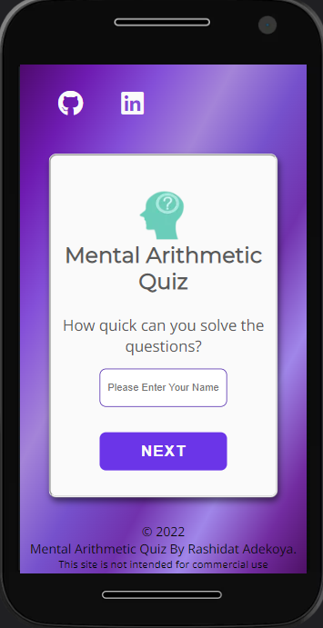

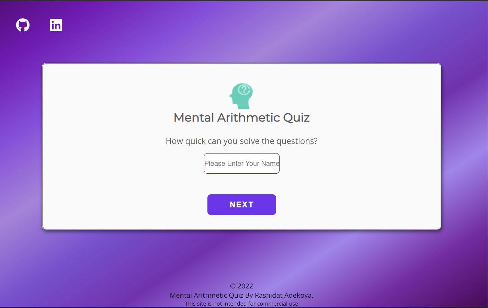

The home page consists of the following features:

+ ### Logo  
  + The logo, featured on the home page is displayed on the main area of the Home Page.
  + It displays an image which denotes an impression of the brain thinking, learning or problem solving.  

+ ### Heading
  + featured on the home page is the quiz name, which is displayed on the main area of the Home Page. 
  + This section introduces the user to the goal of the website  

+ ### User Input Error Message
  + User Input field which takes and stores the name of the user. 
  + User is prompted to enter a username in order to start the game.  
  + An error message is displayed under the input field if the user tries to start the game without inserting username. 
  + An error message is displayed if the username field is empty.
  + The user can press the 'Next' button to go to the rules of the quiz.

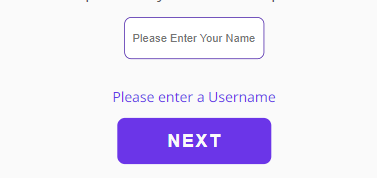

+ ### Username Character Length Error Message
  + An error message is displayed if the username is not valid.
  + The user can press the 'Next' button to go to the rules of the quiz.

+ ### Next Button
  + Next Button is an integral part of the quiz. The text is Capitalised, with white contrasting color to the background with hover effect and highlights the next line of action. 
  + The next Button takes user to the quiz rule page when clicked.

+ ### Social Icon
  + The social media icons are featured on the all pages of the website. It has a hover effect that changes color
  +  It includes links to the relevant social media sites, on the top left corner side. The links will open to a new tab to allow easy navigation for the user.
  * The social media is valuable to the user as they can communicate with the developver via social.

+ ### Footer
  + The footer is located at the buttom center of all the pages, it displays the copyright and the developer information.

  
+ ## Quiz Rule Page
***

  + The quiz rule page consists of the quiz rules, social medial icon at the top left, the footer at the bottom center and two other buttons, the Start Quiz button and the Home button.
  + User is able to read the instructions about the quiz before starting.

  + ### The Start Quiz button
    + The Start Button is an important feature on the Quiz Rule Page. It has white text and contrasting color to the background with hover effect. 
    + After user finish reading the rules of the quiz, user click the start Quiz Button to go to the quiz level selection page.

  + ### Home button
    + The home button with a white text and contrasting color to the background and a hover effect that scales up, is featured on the quiz rule page. 
    + If user choose to click on the Home button, It takes the user back to the homepage.

  + ## Quiz Rule Page on Mobile and larger screens

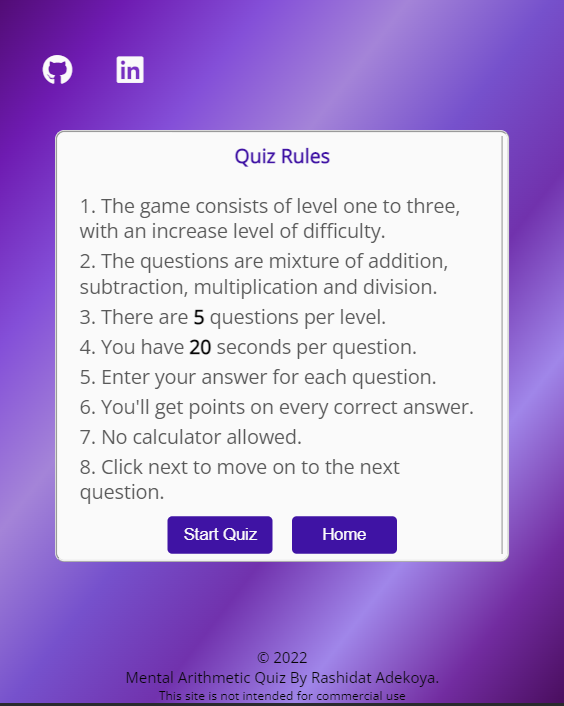

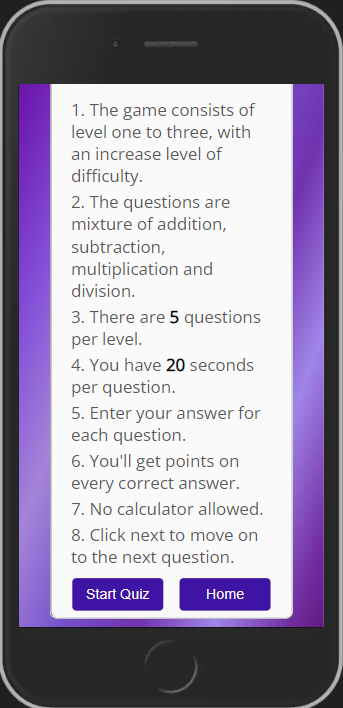

+ ## Difficulty Level Selection Page
***

  + The Level selection page displays the username and the purpose of the page at the top center.
  + It display the social media icon at the top left of the page.
  + This page consists of three difficulty levels buttons, where user can choose which ever levels they which to test themself.
  + Each of the level a user choose takes user to the question page.
  + The page also feature the Home Button, which takes user back to home page if a user decided not to continue.
  + All buttons have a white text and contrasting color to the background and a hover effect that scale up when hovered.

  + ## Difficulty Level Selection Page on Mobile and larger screens

  
  

  ## Quiz Page
  ***

  + It display the social media icon at the top left of the page and the footer at the buttom center of the page.
  + User Name
    + The username is also displayed at the top left.
  + ## Timer  
    + A 20 seconds timer, displayed in orange color for setting it apart.It timed the user to answer the questions before timer ends.
    + It restart from 1 when the user clicks on Next Question.
  + ## Socres
    + The score counter counts a user score out of 5 random questions.
    + Score increases or decreases with the amount of correct or incorrect answer.

    
  + ## Difficulty Level
    + Displays the level a player has chosen (Level 1, Level 2, or Level 3) at the center top.
  + ## Question Counter
    + Displayed at the center top, just below the difficulty Level, and styled in color . It Counts the questions has user clicks the Next Question Button.
  + Question 
    + Question is displayed one at a time, allowing user to read through the questions before choosing an answer within the time limit.

    

  + ## Answer Options  
  
    + Set of four multiple choice answer is displayed as buttons along with each question for user to make a choice of one.
    + The correct choice turns green, while the wrong choice is red, but highlights a green button to indicate the correct answer to the user.

  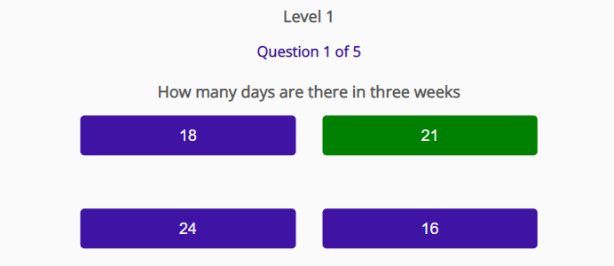
    
  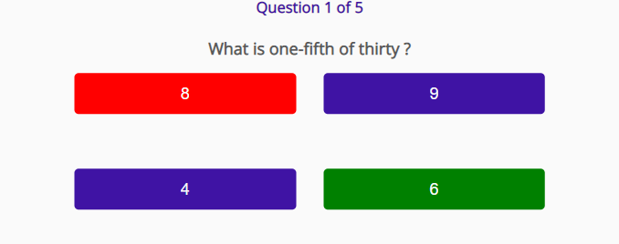

  

  + ## Next Question Buton
    + User use it to navigate to the next question. It's displayed at the bottom center of the question page.
    + User click the Next Button to go to the next question.
    + End of question is displayed on the last question.
    + Next Question Button is swapped with a Result Button

    
  + ## Result Button
    + Result Button is displayed in the same position of the Next Question Button when user is on the last question.
    + Result Button displays the Result page when clicked.

+ ## Quiz Page on Mobile and larger screens

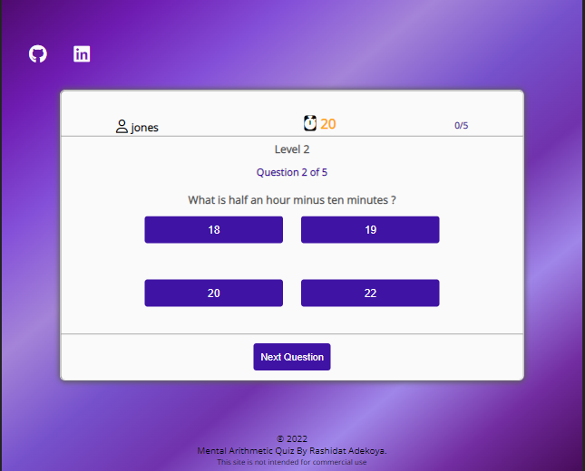

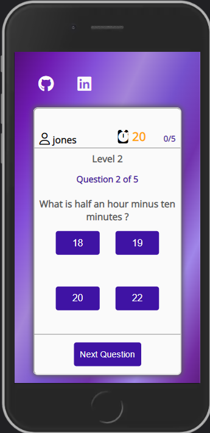

+ ## Result Page
***
  + The result page display the user score. The page consists of a star icon, user's name, with a personalised feedback of user's total score and the Play Again Button.
  + There are three different feedback remark together with one presenting a star icon depending on the user's score. 
  + The icon is meant as a visual reward and to encourage user for their effort and also improve their score at all levels.

+ ## Result Page on Mobile and larger screens

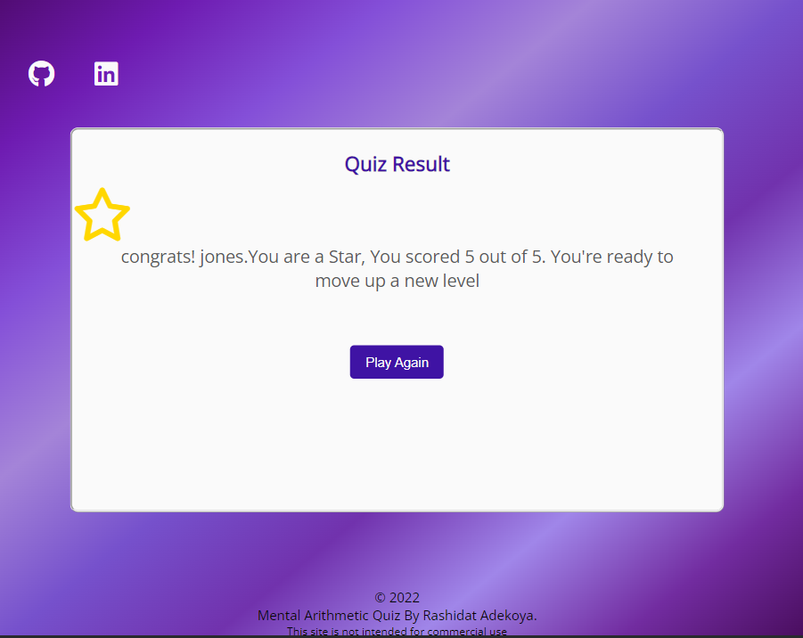

+ ## Play Again Button
  + The button is to encourage user to play the quiz again. 
  + The button refreshes the quiz and take player bak to the home page.

## Future Features
***

The following features can be added at a later date in order to improve user experience: 

+ Add more questions, that will give user different experience everytime.

+ Include a leader board. Where user's data e.g (username, score, time and date) are stored. Making the the quiz more competitive as users will like to be at the top of the list, beating the top score.
+ Create a reward chart to encourage user
+ Give user option to share their performance on social media. This will get more user interested in playing the quiz.  

# 3. User Experience

## Site Goals
   + To be able to view site on range of device sizes.

   + To allow the user to take part in a randomly generated mental arithmetic quiz and specifying the rules for the quiz.

   + To provide a score for the quiz within the allotted time.

   + To allow a fun and enjoyable user experience which will entice users to have multiple sessions.

## User Stories
+  First Time Visitor Goal:
   + I want easily understand the goals of the website.

   + I want to easily navigate the website on any device and on different screen size.

   + I want to open external links in a new tab so they don't have to find their way back to the home page.

   + I want to easily go back to home page. 

   + I want to sharpen my mental arithmetic skills.

   + I want a fun way to keep my mind sharp and to exercise my brain.

   + I want the rules of the quiz to be clearly stated.

   + I want the quiz to be challenging moving up and tackling the next level.

+ Returning Visitor Goal:

   + I want to be able to improve my score.

   + I want to be able answer questions in record time.

   + I want to be able to challenge myself answering questions in all level.

   + I want to be able to be in contact and make suggestions for improvement.

+  Frequent Visitor Goal:

   + I want to see newly generated questions to answer.

   + I want to see enhancement of user experience.

## Design Structure 
***
This quiz is designed with a simple structured layout of simple colors across the pages.
All pages are clearly displayed with easy to read fonts. The pages are easily navigated with buttons.

The main quiz page, display the questions and options clearly, with one question displayed at a time to help user focus.

End of questions is displayed on the last question to inform user it the end of quiz. While the Next question hides away and replaced with Result Button. 

The Score Result display at the end of the question give the user some visual feedback as well as a more personalised feel with the use of their username in the feedback comment.

## Typography and Color Scheme
***
## Typography

+ Google Fonts was used for the following:
+ Open sans is used for the body text on this site for user experience readability, with a secondary sans-serif font.
+ Montserrat is used for headings on the site for readability, simple and clean looking, with a secondary of serif font.

## Color Scheme

+ Mental Arithmetic Quiz uses cold color palette, which is a color that can calm and soothe. The color palette was created using the [Coolors](https://coolors.co/palette/6b35e8-3f13a4-050505-595959-fafafa) website.
+ The colors used are #6B35E8, #3F13A4, #050505, #595959 and #FAFAFA.

 

## Wireframes 
***

The Wireframes were first sketched out with pen and paper, in order to have a preview and work out what's possible and what's not, before transfering the idea to a digital wireframe on Balsamiq. Which give a closer feel of the proposed design. 

[Quiz Home Page Wireframe](./READMEimages/quiz-home-page-wf.png)

[Mobile Quiz Rules Page Wireframe](./READMEimages/quiz-info-page-wf.png)

[ipad Quiz Level Page Wireframe](./READMEimages/quiz-level-page-wf.png)

[Mobile Question Page Wireframe](./READMEimages/mobile-question-page-wf.png)

[Desktop Question Page Wireframe](./READMEimages/question-page-wf.png)

[Result Page Wireframe](./READMEimages/feedback-page-wf.png)

# 4. Technology

## Technologies used

### 1. HTML

### 2. CSS

### 3. JavaScript

## Programs Used

* Git - Was used for version control, the Gitpod terminal to commit and push to GitHub.

* [GitHub](https://github.com/) - Was used to store the project code and display the project in GitHub Pages.

* [Balsamiq](https://balsamiq.com/) - is a mockup software that was used to create the wireframes.

* [TinyPNG](https://tinypng.com/) - Was used for compressing images to a smaller size.

* [Coolors](https://coolors.co/) - Was used for creating a pallet of the colors used.

* [Am I Responsive?](https://ui.dev/amiresponsive) - Was used for showing how responsive design looks on different screen sizes.

* [Font Awesome](https://fontawesome.com/) - Was used to add icons to the social links in the header.

* Google Dev Tools and Lighthouse- Were used to test and troubleshoot the webpage as well as fix problems with responsive design and styling.

* [Google Fonts](https://fonts.google.com/) - Where used to import the fonts used on the website.

* [WebAIM](https://webaim.org/resources/contrastchecker/)- Was used for checking color contrast for accessibility.

* [Favicon](http://faviconer.com/) - Was used to create favicon logo used on the website browser.

# 5. Testing

## Code Validator Testing

+ HTML

  + No errors or warnings were returned when passing through the [official  W3C validator](https://validator.w3.org/) 

  + Document checking completed. No errors or warnings to show.

+ CSS
  + No errors were returned when passing through the official [jigsaw validator](https://jigsaw.w3.org/css-validator/) 

  + Congratulations! No Error Found.

+ JavaScript

  + No errors were returned when passing through the official [Official Jshint Validator](https://jshint.com/) 

+ The following metrics were returned:

  + There are 22 functions in this file.

  + Function with the largest signature take 1 arguments, while the median is 0.

  + Largest function has 17 statements in it, while the median is 4.

  + The most complex function has a cyclomatic complexity value of 5 while the median is 1.
  +  Warnings included;
     + Missing Semicolons:  These were all corrected

     + Three undefined variables: These are variables that have been defined in the (questions.js) file externally.
      These are : (questionsLevel1, questionsLevel2, questionsLevel3)
        	

     + One Unused variable: Theseis function that have been called internally from the HTML. - (optionClick)

## Lighthouse Testing

## Chrome DevTools Lighthouse

### Home Page - Mobile Lighthouse Test

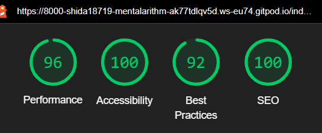

### Home Page - Desktop Lighthouse Test 

### Quiz Rule Page - Mobile Lighthouse Test

### Quiz Rule Page - Desktop Lighthouse Test

### Select Difficulty Level Page - Mobile Lighthouse Test

### Select Difficulty Level Page - Desktop Lighthouse Test

### Quiz Page - Mobile Lighthouse Test

### Quiz Page - Desktop Lighthouse Test

### Result Page - Mobile Lighthouse Test

### Result Page - Desktop Lighthouse Test

## Test Case

## Manual Testing

+ Mental Arithmetic Quiz was tested manually and is compatible with the following browsers:

 + Google Chrome
 + Firefox
 + Microsoft Edge
 + Safari 
 + Opera
and on devices, such as (iPhone, android, surface and Apple ipad). No issues with either the functionality or responsiveness of the quiz.

+ I also went through each page using google chrome developer tools to ensure that they responsive on all different screen sizes.

+ Test the link on every page. Each worked as expected, and any links leading to external pages opened correctly in a seperate browser tab.

## 6. Bugs
***
## Fixed bugs

+ During the Chrome lighthouse test on the quiz rules page, a warning of 'not unable to analyse the page' you popped up. But also advice to check all extension.

   + This was quickly fixed after disabling the extensions.

+ When checking the User Input for validation to check if the function was working, I realised user can actually start without any user name input as the quiz rules can be displayed. So, this will allow user to start the quiz without a log in.

+ This Bug nullified the error messages (please enter a username / Username must have maximum of 8 characters), as the messages get displayed but user can still start the quiz without obeying the userInput function. While, the Home Page is also displayed with the Rule Page.

   The if statment and the character index was change to greater than or equal to from less than 6.

    else if (playerName.length >= 8)  
    ruleBox.style.display = "none"; 

    To hide the Quiz rule and another if statement : (errorTxt !== ''), to display the error message. 

+ When the levelTitle.innerHTML was added to the event listener, the page goes blank each time the level is cliked from the select level page. Google Search and [MDN](https://developer.mozilla.org/en-US/docs/Web/API/Window/DOMContentLoaded_event) helped figure this out.

### Solution:
   + This was resolved by using :

   addEventListener('DOMContentLoaded', () => {});

+ When checking to see that all the buttons work correctly, I realised, the Home button when clicked from the Quiz Rules page,  will go to the home page as normal. However, if the name input is still displayed when the Next Button is clicked, it opens the Quiz Rules Page while the Home page is still open.

### Solution:
   + This was resolved by using :

   window.location.reload();

   This function refreshes the content.

+ Username displayed - I was getting the username displayed on two pages, the (Level selction page and the Quiz page). The name only showed up on the Level Selection Page.

+ Reason for this was because, I thought it's just using the userNameInput 'id'. So, I was looking to get the element reference to display the name on both pages. 

+ After google search. I realised it's a bad practice to call an ID on different task.

### Solution:
   + This was resolved by using :

   class instead of an id element.

+ Question Counter(questionNum) - I found here, when the Next Question Button is clicked, it was not displaying the question number accordingly as number of questions should be adding up on the click of Next Button. But instead the question counter would display the position of the question inside the array.  Here is an example of the bug: 

### Solution:
   + This was resolved by :

   Passing the questionCounter in as an integer and adding one inside an if statement contained in the (nextQuestion()) function.

   questionsCounter.innerText = parseInt(questionsCounter.innerText) + 1;

+ User - Score display one less every time the question ends.

### Solution:
   + This was resolved by :

   Using the ++x (pre-increment) method inside an If statement, to increase the count every time the user clicks an option button to make a choice.

   ++userScored;
        userScore.innerHTML = `${userScored}/5`; 

+ Timer - The time counter counts up to 20 seconds according to what was set, then would jump to the next question as expected, if no activity completed within that time. However, the time would stop counting immediately if there is no activities performed by the user, such as going on to the next question.

+ This negates the purpose of getting the user getting to beat the time within the stipulated time.

### Solution:
   + This was resolved by :

   Setting the time counter to 0 index inside the if statement, and the clearInterval to reset it to zero. Initially the time counter was not set to 0.

    if (timer === 20) {
        clearInterval(interval);
        nextQueBtn.click();  
        timeCounter.innerText = 0    
    } else {
        timer++;
        timeCounter.innerText = timer;
    }  

+ Next Question Button - Would always threw error at the end of the quiz.

+ The error pointing to a 'Syntax error of unable to read an undefined question'.

### Solution:
   + This was resolved by :

    nextQueBtn.disabled = true;

    This was used to disable the reading after the quiz questions end.

+ Swapping the Next Question Button with Result Button when the quiz finished in order to advise user its end of questions.

+ Here I have used the if stamtement if(questionNum == 5), But I was unable to get the Result Button displayed, because I put the condition inside the else rather than the if. So, The 'End of questions will be displayed without a button to show the result.

### Solution:
   + This was resolved by :

  if(questionNum == 5){
    
        quizEnd.innerHTML = `End of Questions.`;
        resultBtn.style.display = "block";
        nextQueBtn.style.display = "none";
        nextQueBtn.disabled = true;

  This was resolve by adding the resultBtn inside of the if condition rather than on the outside.

  + HTML Bug
  + 
  
  This was a rsult of a missing closing div inside on the index file.

  ### Solution:
   + This was resolved by :

    This was fixed by proper indentation, which allow me see where the particular 'div' was causing issue. 

## UnKnown Bugs

When the testing was done on a Motorola G8 Powerlite, the time counter was reading faster than on other mobile devices test have been carried on.

***

## 7. Deployment

+ Github Pages

This online quiz was deployed to GitHub Pages. The steps taken in deploying this project are as follows:

+ Log on to GitHub and select 'MentalArithmetic-Quiz' from the list of repositories.
+ Click on 'Settings' on the menu just below the repository's name.
+ Navigate to the left side menu and click on 'Pages' in the 'Code and Automation' section.
+ In the Main area under 'Build and Deployment', click on the source dropdown menu and select the 'Deploy from Branch' selection.
+ In the 'Branch' section select the main branch and the /(root) folder.
Click 'Save'.
+ A message that the site is ready to be deployed appears just under the 'GitHub Pages' heading. After refreshing the page, the link to the deployed sit appears.
+ Your live GitHub pages site is now deployed and the URL shown at the top of the page.
+ Click on the link to go to the live deployed page.

View the online quiz here [Mental Arithmetic Quiz](https://shida18719.github.io/Mental-Arithmetic-Quiz/)

***

# 8. Citation of Sources

+ [Code Institute Lesson Content](https://learn.codeinstitute.net/dashboard)

+ The Shuffle function was taken from [jsfiddle](http://jsfiddle.net/gautamz07/zotsc64e/)

+ Code used for the optionClick function was adapted from [Sitepoint](https://www.sitepoint.com/simple-javascript-quiz/)

+ The setInterval function was adapted from youtube video [Code Now](https://www.youtube.com/watch?v=3fbU4z7fPe4)

+ [sebhastian.com tutorials](https://sebhastian.com/javascript-clearinterval/)

+ [MDN](https://developer.mozilla.org/en-US/docs/Web/API/Window/DOMContentLoaded_event)

+ [Grepper](https://www.codegrepper.com/code-examples/javascript/else+if+in+js)

+ [WAI ARIA](https://w3c.github.io/aria/)

+ [Stack Overflow](https://stackoverflow.com/questions/53766944/simple-quiz-with-different-levels-divs)

+ [W3Schools](https://www.w3schools.com/js/default.asp)

 + ## Media

   + The logo imaged used for the home page was taken from [pngtree](https://pngtree.com/)

+ ## Content
 + Quiz questions were taken from Schofields & Sims

 ***

 # 9. Acknowledgments

  I would like to acknowledge the following people who helped me along the way in completing my first milestone project:

  + My family, for their uderstanding and support both morally and mentally.

  + The slack community, for always being there.

  + [MiaRasmussen_5P](https://github.com/MiaRasmussen05), for her great support and time and for mixing the gradient colors.

  + Tutor - George-Alexandru Ciobanu, for the time spent in guiding and explaing the steps to figuring things out .

  + My Code Institute mentor jubril_mentor, for helping me understand how to think logically before writing codes in programming.
  
  + [Okurut_5p](https://github.com/kedi1991/), for is advice and suggestions during this projects. 

-----

-----

